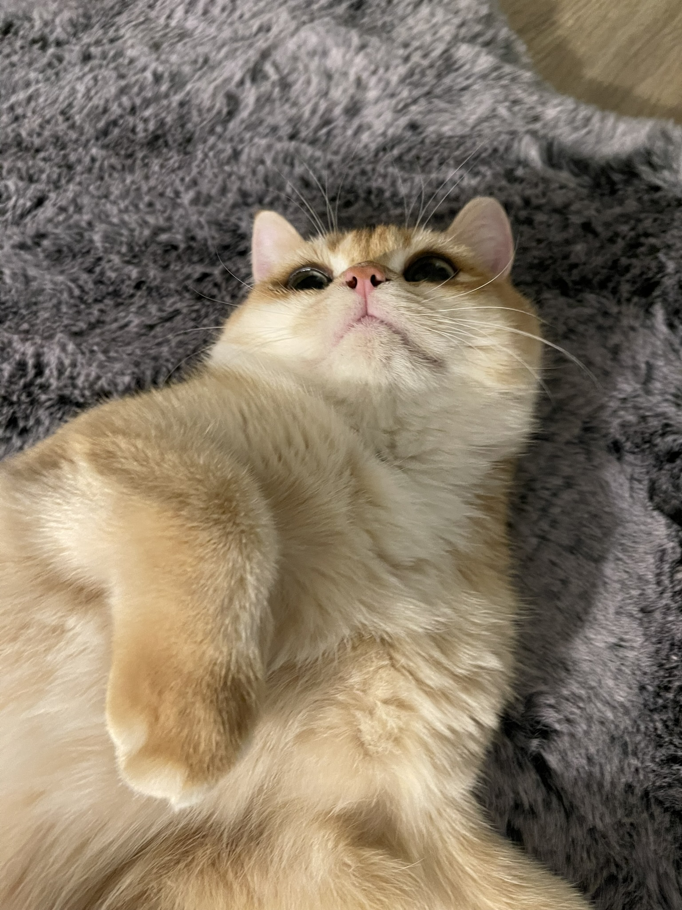

### Hi there 👋 I'm Shenfan
🎓 I'm currently pursuing a Master of Science in Computer Science & Engineering at Ohio State University, with an expected graduation in May 2026.

🛠 Skills:
Languages: C/C++, C#, Java, Python, R, F#, HTML/CSS, Javascript
Software/Frameworks:MySQL, Linux, SQLite, Git, TensorFlow

📫 Get in touch:
LinkedIn： https://www.linkedin.com/in/shenfan-feng-4006b6273/

- ⚡ Fun fact: Aiyu is a cute cat

<!--
**Zayn407/Zayn407** is a ✨ _special_ ✨ repository because its `README.md` (this file) appears on your GitHub profile.

Here are some ideas to get you started:

- 🔭 I’m currently working on ...
- 🌱 I’m currently learning ...
- 👯 I’m looking to collaborate on ...
- 🤔 I’m looking for help with ...
- 💬 Ask me about ...
- 📫 How to reach me: ...
- 😄 Pronouns: ...
- ⚡ Fun fact: ...
-->

